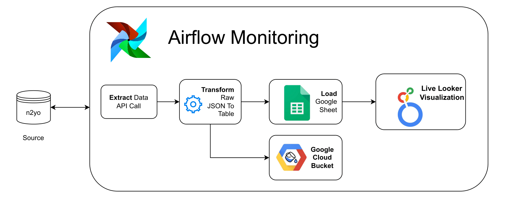
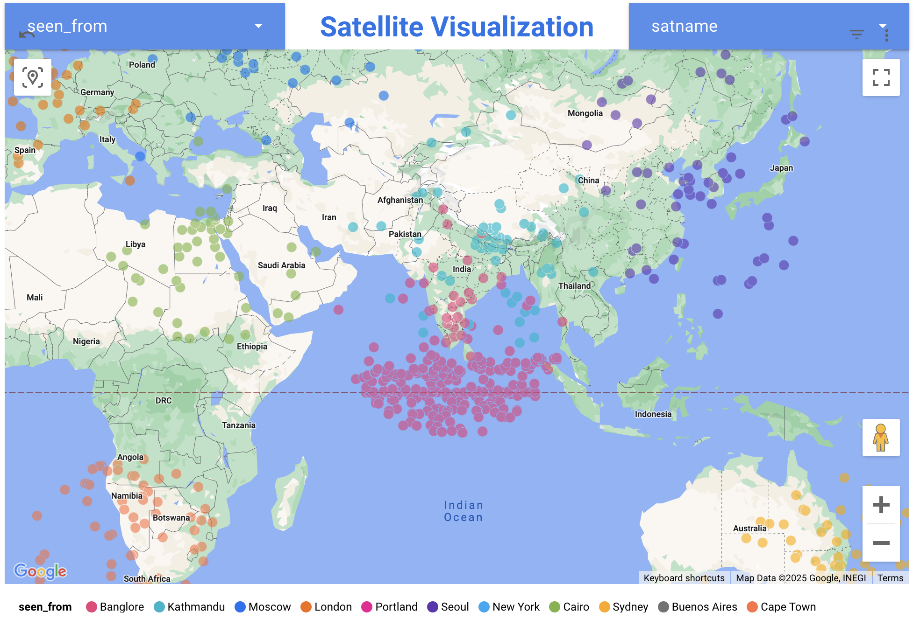
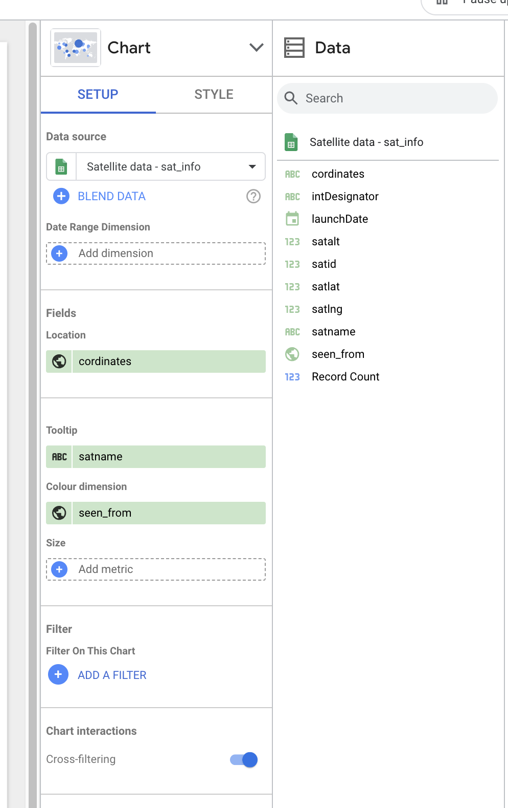

# Satellite Visualizer

This repository includes code to create an Airflow DAG that imports real-time data from an API, transforms it, and exports the processed data to a Google Sheet for visualization through Looker.
<div align="center">
    
    
</div>

Live Visualization: [here](https://lookerstudio.google.com/reporting/a67cd1c9-4a5e-47a0-aa1c-06cc813a64d6)


## Prerequisites
- Python 3.10 or later
- Anaconda or Miniconda (optional, can use a python virtualenv instead)

## Installation
### 1. Create a conda environment
```
conda create -n satellite_visualizer python=3.10
conda activate satellite_visualizer 
```
### 2. Install Dependencis

```
pip install -r requirements.txt
```
## Airflow Configuration
Create a folder name airflow
```
cd airflow
```
Create a local database
```
airflow init db
```
Change the dags_folder in `airflow.cfg` file 
```
[core]
dags_folder = ./satellite_visualizer
```

# Create a Admin user
```
airflow users create 
--username <your username>\
--password <your password> \
--firstname <your name> \
--lastname <your lasname> \
--role Admin \
--email your-email@example.com
```
Run Scheduler
```
airflow scheduler
```
Run webserver
```
airflow webserver --port 8080
```

# Configuration 
Step 1: \
Create a folder name `keys` and create text file name `ny2o_key.txt`. Add your API Key optained from [https://www.n2yo.com/](https://www.n2yo.com/). 

```
.
├── README.md
├── airflow_dag.py
├── keys
│   ├── ny2o_key.txt
├── project
│   ├── app.py
│   ├── locations.py
│   ├── ny2o_api_caller.py
│   └── parse_api_responses.py
└── requirements.txt
```

Step 2: \
Change `spreadsheet_id=<Google Sheet ID>`
For example: https://docs.google.com/spreadsheets/d/1SriNNkVd2gF-MCL9dtD53cyx7B5cMNiDCTSPHtN4ab8/edit?gid=2137809253#gid=2137809253

`spreadsheet_id = 1SriNNkVd2gF-MCL9dtD53cyx7B5cMNiDCTSPHtN4ab8`

## Looker Visualization
Now that our data is in Google Sheets, the final step is to explore how Looker can present it in a visually appealing way. Looker, a powerful visualization and analytics tool from Google, allows you to connect to various data sources and create dashboards, charts, and reports.

Start by opening Looker Studio, which is easily accessible through your Gmail, just like other Google services. When prompted, select Google Sheets as the data source, and choose the sheet where your data is stored. Make sure to select the sheet containing the actual data (if you followed my setup, this would be the ‘sat_info’ sheet).

Looker will automatically generate some default charts using your data, but we’re aiming to create a map visualization. First, remove all the default charts. Then, add a Google Map bubble visualizer to showcase your data effectively.

My configuration:

<div align="center">
    
</div>